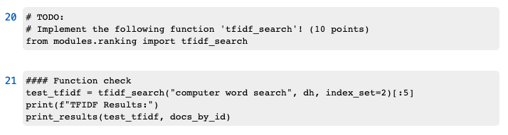
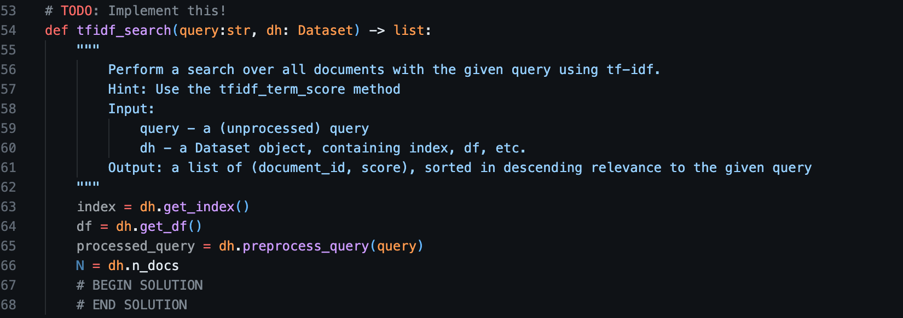

# Information Retrieval 1 - Assignment 1
*Course from the Master Artificial Intelligence at the University of Amsterdam (Edition 2025)*

## Introduction
Welcome to IR1 assignment 1, This assignment is worth 30% of your assignment grade.
In this assignment, you will become familiar with term-based matching approaches and evaluation metrics in information retrieval. Specifically, the learning objectives for this part are:

**Objectives**:
- Term-based (unsupervised) matching and evaluation:
    - Preprocess a dataset.
    - Implement several unsupervised first-stage retrieval methods (TF-IDF, BM25, QL, NaiveQL) and understand their weaknesses & strengths.
    - Evaluate the retrieval methods and interpret the results.
 
## Scoring and Submission Guidelines for Assignment 1  

To achieve a full score on **Assignment 1**, you must complete both the **implementation** and **analysis** components. The weight distribution is as follows:  

- The **implementation component** accounts for **1/3 of your Assignment 1 grade**. Your score for this component is determined by the number of autograding tests you pass. To maximize your score, ensure that your implementation meets all specified requirements.  
- The **analysis component** constitutes **2/3 of your Assignment 1 grade**. This part will be **manually graded** based on the clarity, depth, and correctness of your explanations and insights. To maximize your score, ensure that your analysis is thorough and well-organized. You will need to have the implementation component finished to complete the analysis.

### Submission Requirements  
- You will implement your **code in the provided Python files**.
- Push your code to your **GitHub repository**.
- You will perform your **analysis in a Jupyter Notebook**, but you must write a **concise report in LaTeX** summarizing your findings.  
- Submit your **compiled PDF of the report** via **Canvas** before the deadline.  

## Guidelines

### How to proceed?
We have prepared two notebooks: 
- [`assignment1.ipynb`](./assignment1.ipynb) including detailed guidelines of where to start and how to proceed.
- [`analysis.ipynb`](./analysis.ipynb) is used to conduct experiments for the analysis and to generate the `trec` result files that you are required to push. If you want to generate the `trec` files without completing the whole analysis section of the [`analysis.ipynb`](./analysis.ipynb), just execute the first three code cells of the [`analysis.ipynb`](./analysis.ipynb) (i.e., to import the necessary libraries and download the dataset), and then execute the code cells in the section `Section 5.2: Advantages & Disadvantages of Approaches`. These `trec` files in your repository are used to populate the leaderboard, so you may prefer to start generating them early.

As you proceed, notice that the implementation of some functions are already given, and you only need to use them. Whenever we want you to implement a method, we will explicitly let you know what function you should implement, and in which file in modules directory you should implement that. For instance, take the following example:

Notice the #TODO sign! You are asked to implement `tfidf_search` function, and you need to write your implementation
in `modules.ranking` at `tfidf_search` method. You can find relevant information on the expected inputs and outputs and
functionality of that method in the provided docstring as shown:

**NOTICE THAT YOU NEED TO PUT YOUR IMPLEMENTATION BETWEEN `BEGIN \ END SOLUTION` TAGS!**
All of the functions that need to be implemented in modules directory files have a #TODO tag at the top of their definition.

### Grading
When you push to your repository on GitHub, unit tests will automatically run as in the previous part0. You can view the total points available and the points awarded to your current implementation following the same process as in part0 (i.e., click the 'x' or 'checkmark', and then view the output inside the 'Autograding' section).

### Analysis
In this part of the assignment, you need to evaluate your search functions with the evaluation functions that you develop. The guidelines on how to proceed in this section are discussed in detail in the notebook. As opposed to the rest of the assignment, in this part, you do not need to implement any functions. Instead, you need to write a **report in Overleaf** about the evaluation results with a table summarizing the results as explained in **Section 1.2: Advantages & Disadvantages of Approaches** in [`analysis.ipynb`](./analysis.ipynb). Overall, you need to complete the code, run the code, and generate the metrics from [`analysis.ipynb`](./analysis.ipynb), then transfer them to your **LaTeX report**, filling in your answers, table of results, and summary.

You also need to ensure that the automatically generated runtime files are filled correctly without any errors! These files have names ending in `.trec`, such as `TF-IDF_1.trec`. Together with your report, they will be used for grading, so make sure to push them to the repository. They are created by `evaluate_search_fn`, as you can see in Section 5.1. Refer to the [`analysis.ipynb`](./analysis.ipynb) comments above for more information on how to generate these files. 

**Resources**: 
- Sections 2.3, 4.1, 4.2, 4.3, 5.3, 5.6, 5.7, 6.2, 7, 8 of [Search Engines: Information Retrieval in Practice](https://ciir.cs.umass.edu/downloads/SEIRiP.pdf)

### General remarks on assignment organization
At this point, you should already be familiar with Git, the organization of directories and files in the assignments, and how to submit. We recommend you to review the `README` of the pre-assignment to refresh you mind about file organization and directories.

**General Submission instructions**:
- Only the last commit of the main git branch will be graded
- Submission happens automatically at the deadline; after the deadline passes, you can no longer push to your repository, and its current contents will be graded
- `# TODO` indicates that you should implement a function.
- For this part: You can use the `nltk`, `NumPy`, and `matplotlib` libraries. Other libraries, e.g., `gensim` or `scikit-learn`, may not be used.
- Please use Python 3.8+ and `pip install -r requirements.txt` to avoid version issues. (This will happen automatically if using Codespaces. When using your own laptop, Colab, etc you will need to install requirements.txt.)
- You can create additional helper functions / classes as long as the API we expect does not change. For example, you could create a helper function for use in `tfidf_search`, as long as the function signature and return value of `tfidf_search` itself does not change. 
- One repository per each group needs to be submitted. You should collaborate with each other within the same repository.
- You are not allowed to change the definitions of the functions that you need to implement. Doing so will lead to failed tests and point deductions
- If you work with the notebook, it's helpful to [find a way to reload modules without reloading the notebook](https://stackoverflow.com/questions/5364050/reloading-submodules-in-ipython/54440220#54440220).
- Do not substantially change the contents of [`assignment1.ipynb`](./assignment1.ipynb). The contents in the assignment1.ipynb notebook
or file are **NOT** used for grading! Their purpose is to help you understand how the modules and functions fit together.
- **You are not allowed to change the contents of .github directory!** Changes to anything in this directory will result in an automatic zero on the assignment, and we will additionally consider it cheating
- Do not forget to finish the analysis from the [`analysis.ipynb`](./analysis.ipynb) and then move your results and conclusions to the LaTeX report.
- Do not forget to also submit your report with table summarizing the evaluation results as explained in [`analysis.ipynb`](./analysis.ipynb) in the
root directory.
- Do not forget to push the trec files that can be generated by just executing the first three code cells of the [`analysis.ipynb`](./analysis.ipynb) (i.e., to import the necessary libraries and download the dataset), and then executing the code cells in the section `Section 5.2: Advantages & Disadvantages of Approaches`.
- Be concise in your answers 
- Important: please complete and use the helper methods indicated in the docstring of each method (note the hints) because they will also be evaluated